### Hi there 👋

<!--
**djotaku/djotaku** is a ✨ _special_ ✨ repository because its `README.md` (this file) appears on your GitHub profile.

Here are some ideas to get you started:

- 🔭 I’m currently working on ...
- 🌱 I’m currently learning ...
- 👯 I’m looking to collaborate on ...
- 🤔 I’m looking for help with ...
- 💬 Ask me about ...
- 📫 How to reach me: ...
- 😄 Pronouns: ...
- ⚡ Fun fact: ...
-->

I'm a Pythonista (🐍) and sometimes Gopher (🐹) who creates programs and scripts to solve problems in my life. (I have also dabbled in video game development) My ultimate achievement is the ELDonationTracker below, which is a utility for folks raising money via the Extra Life charity. I used to participate in Advent of Code, but no longer do so. (I also had to remove the repo because it had my puzzle inputs) 

Since 2024 my pace of development has lowered a bit as I focus on other hobbies.

### ✍ Latest Blog Posts

<!-- BLOG-POST-LIST:START -->
- [My Year in Programming: 2025](https://www.ericsbinaryworld.com/2026/01/04/my-year-in-programming-2025/)
- [2024 Programming EOY](https://www.ericsbinaryworld.com/2024/12/25/2024-programming-eoy/)
- [Advent 2024 Day 04](https://www.ericsbinaryworld.com/2024/12/04/advent-2024-day-04/)
- [Advent 2024 Day 03](https://www.ericsbinaryworld.com/2024/12/03/advent-2024-day-03/)
- [Advent 2024 Day 02](https://www.ericsbinaryworld.com/2024/12/02/advent-2024-day-02/)
<!-- BLOG-POST-LIST:END --> 

### 🎲 Github Stats

### 💻 Check out these Repos

#### 🐍 Python

#### 🐹 Go

#### 🎮 Unity

#### 🔌 Electronics

#### 🚀 Misc

